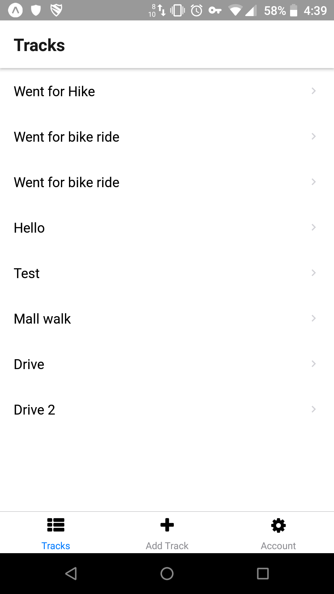
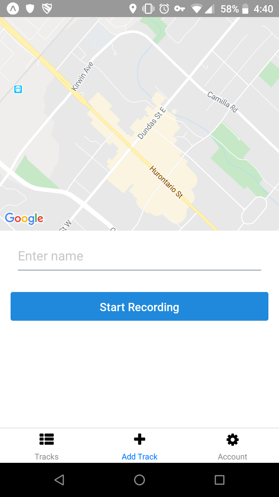

# Tracks

This is an example app made with React Native that allows you to keep track of the trips you take while using the app.

## Installation

1. Setup and run the [server](https://github.com/charmata/tracks-server).
2. Clone this repository and enter the directory.
3. Run `yarn`
4. Run `yarn global add expo-cli`
5. Create a `.env` file and enter the following:
   - `API_URL=<your server url>`
6. Run `expo start`
7. Download the Expo app and scan the QR code in the terminal.

## Technologies used

- React Native
- Expo
- React Native Elements
- React Native Maps
- React Navigation
- Axios
